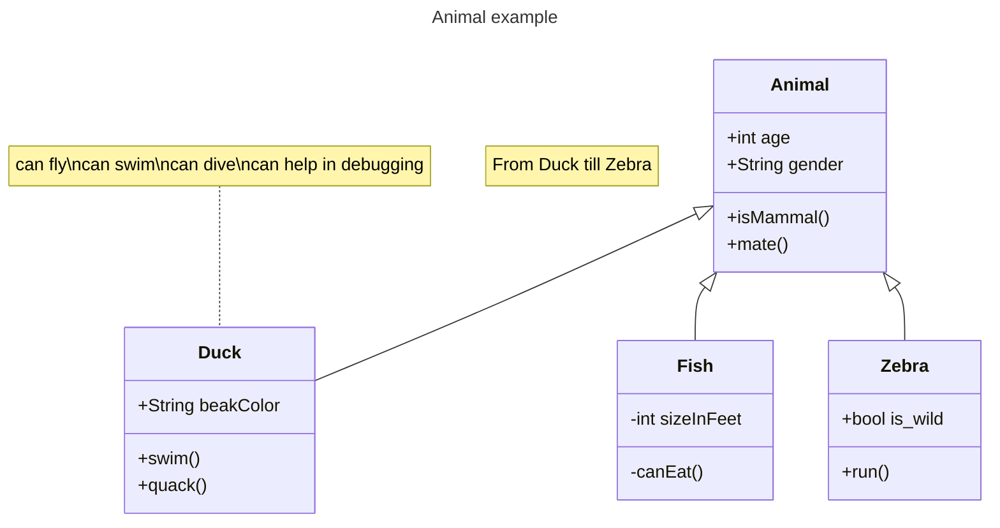

# 배포 절차

소유자: Seongi hong
태그: 가이드와 프로세스

<aside>
💡 이 템플릿에서는 엔지니어가 따라야 하는 배포 절차를 설명합니다.

</aside>

# 1. Slack #배포 채널에서 알림 전송

Slack 채널에서 배포 시작을 알리세요.

# 2. SSH로 배포 서버에 접속

<aside>
💡 `/코드`를 입력하고 `Enter` 키를 눌러 코드 블록을 만들 수 있습니다.

</aside>

```bash
ssh deployments.acmecorp.com
```

- 단축키 `Cmd/Ctrl + e`를 사용하여 `인라인 코드 스니펫`을 만들 수 있습니다.

# 3. 배포 명령어 실행

```bash
acme deploy --prod
```


